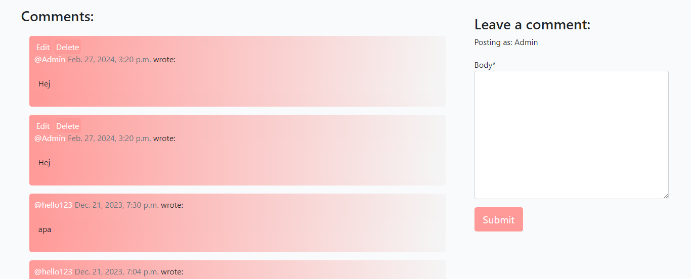

# FoodFace

FoodFace is originally a business idea that gathers recipes from around the world to create the greates cooking library the world has ever seen. With recipes both found by the company and provided by the users. Together it will create a rich variation of recipes and food experiences and with some extra features FoodFace is complete.

This is the part of FoodFace that makes it possible for the users to post their food experiences and share them with others and contribute to the library.

## Worth Mentioning
* Not a Food blog - During the process of the project it did not become very clear that the purpose of the site is to contribute with creative recipes and that FoodFace is especially created for that purpose. So for this project you can now create what ever post you would like. I would with more time change the style and add features in order to maintain the main idea with the project.

* Post Content - The content from the posts are generated from [ChatGPT](https://chat.openai.com/) with simple prompts containing the topics.
---

## UX
---
* Navigation 
  - Navigation bar - In the navbar the user can navigate around the site with ease and find the related content for the users purpose.
  - Buttons - Through out the site, buttons appear near related content in order to make it possible for the users to create and delete the respective data if authenticated and owner of the content.

* Posts
    - CRUD - The users have the ability to create, read, update and delete posts in what ever way they like as long as they want as long as they are the owner of the post. If they are not, they are only able to create and read posts.
    - Comment and Likes - If the user is authenticated they can interact with other posts in order to participate in conversations and share their oppinion about the matter.

* User Authentication
  - Full accesse - Once the user is authenticated they have full access to the functionality FoodFace provides.
  - Profile - When creating a FoodFace account you will automatically be assigned a profile, this profile can the user update with a profile picture and some information about themselves. This part is important for future features.

* Admin - As a Site Admin you have exactly the same access as a regular user but once logged into the admin panel you can approve posts that are set to draft (Created posts are automatically set to draft in order to prevent "bad" posts). In addition to that the Admin can also delete posts, comments and users from the site.

## Agile Development
---
  * User Story's - I have created user storys for the features added to the site, the template I used is the following: "As a **role** I can **capability** so that **received benefit**". All the user story's can be found [here](https://github.com/users/Bigkaboon/projects/4/views/1).

## Features
---
* Authentication - The user is able to register for an account that they can log in to and make the other features possible to use.

* Posts - Once Authenticated the user can create posts and afterwords edit and delete them if wanted. Without authentication the user can only display other users posts.

* Comments - Much alike with posts a unauthenticated user can only read comments but once loged in to an account the user can comment on posts, edit and delete them.

* Likes - Likes are displayed right under the post both in the post feed and while viewing a specific post. As usual the user can only like a post once loged in to an account.

* Profile - Once the user is creating a account their profile is created, this is a important part for future features like DM's and adding other users as friends. User can at the moment edit it in the way they like and save it.

## Testing

---
* [HTML](https://validator.w3.org/) - When converting forms into HTML code it generates errors that I cannot effect since its converted from Either CrispyForms or SummerNote. Besides that, no errors
* [CSS](https://jigsaw.w3.org/css-validator/) - no errors
* [JavaScript](https://jshint.com/) - no errors
* [Python](https://www.pythonchecker.com/) - no errors

## Features left to implement
---
* Add/follow Users - I wanted users to have the ability to add other users so that they can have a seperate feed that displayes their respective posts and then change the "default" feed to a mix of popular and latest releases. This also connect to the next feature to implement.
  
* DM's - Once users are friends I want them to be able to communicate, this open up doors for the users and takes the site to the next level and can create other possible purposes of using the site for the users.

## Bugs

* Trying to view a post unauthenticated will result in a 500 error - The error is left since it's caused by linking to profiles in the comments and I needed ways to navigate to users profiles.

## Process
---
* Priority - Since the short time span the first thing I did was creating a priority list where functionality and CRUD was the highest priority and doing only what is nessecary in order to move forward in a effective pace and still make sure the site contains all the functionality needed.

* Planning - Once the list was created I started planning the process of what order I should complete the steps while following my prioritys. This resulted in creating the database models and functionality first and then pay attention to design. In the planning phase I also created the main user storys that are the pillars of the application.

* Database - The first thing I did was creating the Database and made sure I was able to create and store data there. Then I moved on to the functionality

* Functionality - Once the database was set up I created the superuser and the first model that was Post which at this stage only implies that the Admin can create, read, update and delete posts in the Admin panel. Once that worked I moved on with the rest of the user storys while taking inspiration and following along the walk through project to reduce the chance of making unneccesary mistakes that takes time from the process.

* Design - When the functionality is as complete as I had time for I started with the design, since I came up with the main idea of FoodFace a few years ago in school I allready had a vauge picture of the design in my head which I build from, that picture was mostly regarding colors and layout so I started with applying that on the allready existing layout (allmost identical to walk through) and moved forward building on that.

* Documentation and Testing - Once the design was as done as I had time for I started the documentation and testing.

* Failed Validation - The first time I validated the code it got all messed up of a unknown mistake I did trying to fix the errors from the python validator. What I did to fix this was to get back to the latest commit before I started validating and than used the following commands in the CLI in order to validate all python file automatically:

  *  pip install --upgrade autopep8
  * autopep8 --in-place --aggressive --aggressive *.py

## Results-
---

* Goals complete 
  * Functionality 
    * Authentication - I was exited to learn about authentication and Im happy that I have managed to use it in my own application in a efficient way.
    * Idea to reality - I have managed to create an application with what I have learned through out the course so far to make a couple of years old idea to reality.
  * Databases - I have succesfully used databases and used them in a way to improve my application.

* Goal yet to be scored
  * Design
    * Unclear - In my oppinion the design do not show the visitors what the purpose of the media is, It not much showing that is related to food or cooking except for the name which I think I failed with.
    * Details - Reflecting the purpose or not I want to add more details to fill out the site e.g a background with minimalistic details preferrebly related to cooking.
  
  * Functionality
    * Posts - When creating posts there are no layout or structure on how you should write your post which would be prefferable when creating recipes in order to improve UX.
  
    * Unimplemented features - Since FoodFace originally was an old Idea of mine and to really make it as I thought I would at least have to implement the last user storys but since I encountered problems trying to implement them while the clock was ticking I had to reprioritize and start with the design phase.
* Summary - To summarize I am satisfied that I have used what I have learnd throughout the course. Allthough design is a bit off and the application don't contain all the functionallity I wanted it to do I have managed to provide the users with CRUD functionality and made a usable site.

## Credits
---
* [Blog Walkthrough project](https://github.com/Code-Institute-Solutions/Django3blog)
* [Stack overflow](https://stackoverflow.com/)
* [Slack](https://app.slack.com/client/T0L30B202/D05UMBW2NKY)
* [Django Docs](https://docs.djangoproject.com/en/4.0/)
* Mentor - My mentor helped me solve problems and ease the process a greate thanks!
* Other students projects
  * 1 - [My Meal Planner](https://github.com/AliOKeeffe/PP4_My_Meal_Planner)
  * 2 - [Little Learners Lab](https://github.com/RoshnaVakkeel/Little_Learners_Lab_Logs)

* [ChatGPT](https://chat.openai.com/) - For more specific questions and instructions
* [Youtube](https://www.youtube.com/) - Django related tutorials.

  
